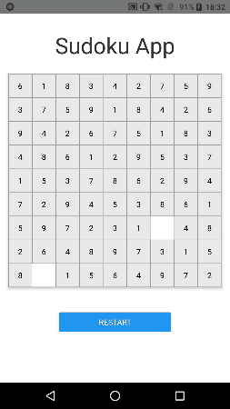

# Sudoku App

## Run instructions for iOS

    npx react-native run-ios
    - or -
    • Open promodoro/ios/promodoro.xcworkspace in Xcode or run "xed -b ios"
    • Hit the Run button

## Run instructions for Android

    • Have an Android emulator running (quickest way to get started), or a device connected.
    • npx react-native run-android

## Demo

